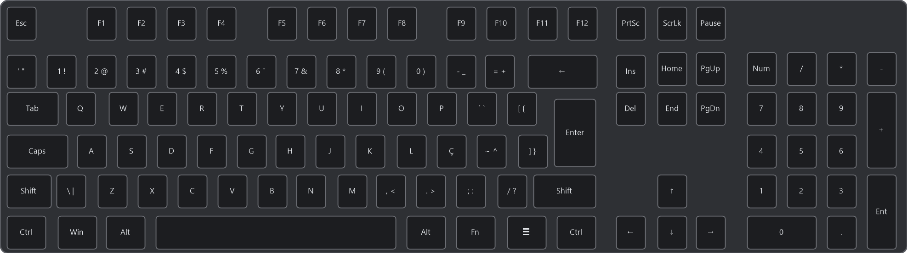

# Plugin SignalRGB para o teclado Redragon K556 Devarajas (ABNT2)

Plugin não oficial que faz o [SignalRGB](https://signalrgb.com) reconhecer o **Redragon K556 Devarajas** (modelo **RD-BBK556**, layout **ABNT2**) e controlar o RGB de cada tecla com os efeitos do SignalRGB.



> [!NOTE]
> **Este projeto foi feito com a ajuda do Claude AI**, da Anthropic. Eu não sou programador: a descoberta do protocolo, o código e esta documentação foram feitos em conjunto com a IA. Por isso, posso não conseguir responder sozinho a dúvidas técnicas mais profundas. Mesmo assim, abra uma [issue](../../issues) se algo não funcionar: vou tentar ajudar no que eu puder, e outras pessoas também podem responder.

> [!WARNING]
> **Não use o modelo "Redragon K580" no plugin EVision que já vem no SignalRGB com este teclado.** Ele manda comandos que o firmware do K556 não aceita e pode **travar o teclado e bagunçar as teclas** (exige reset de fábrica). Este plugin foi feito justamente para evitar isso. Veja o Passo 4.

---

## O que você precisa

- O teclado **Redragon K556 Devarajas ABNT2** (etiqueta **RD-BBK556**), conectado **pelo cabo USB**.
- O **SignalRGB** instalado. Ele é gratuito e pode ser baixado em [signalrgb.com](https://signalrgb.com).
- Uns 5 minutos.

Você não precisa saber programar nem instalar mais nada.

---

## Instalação passo a passo

### Passo 1: Baixe o arquivo do plugin

1. Aqui nesta página, clique no arquivo **`Redragon_K556_Devarajas_ABNT2.js`**, na lista de arquivos lá em cima.
2. Na página que abrir, procure no canto direito o botão de **download** (um ícone de seta para baixo, com a dica "Download raw file") e clique nele.
3. O arquivo vai para a sua pasta **Downloads**.

> [!TIP]
> O nome do arquivo precisa terminar em **`.js`**. Se o navegador salvar como `.txt` ou mudar o nome, renomeie para `Redragon_K556_Devarajas_ABNT2.js`.

### Passo 2: Coloque o arquivo na pasta de plugins do SignalRGB

1. Abra o **Explorador de Arquivos** (o ícone de pasta amarela na barra de tarefas, ou as teclas `Windows + E`).
2. Na barra de endereço lá em cima, cole o caminho abaixo e aperte **Enter**:

   ```
   %USERPROFILE%\Documents\WhirlwindFX\Plugins
   ```

   Se o seu Windows estiver em português e esse caminho não abrir, tente:

   ```
   %USERPROFILE%\Documentos\WhirlwindFX\Plugins
   ```

3. **Mova ou copie** o arquivo `Redragon_K556_Devarajas_ABNT2.js` da pasta **Downloads** para essa pasta **Plugins**.

> [!TIP]
> Se a pasta **Plugins** não existir, abra o SignalRGB uma vez e feche, ou crie a pasta com esse nome dentro de `WhirlwindFX`.

### Passo 3: Feche os outros programas de RGB

Só um programa pode controlar o RGB do teclado por vez, senão eles brigam.

1. Feche o **software da Redragon** e o **OpenRGB**, se você usar.
2. Olhe também perto do relógio do Windows (na setinha **^** da barra de tarefas). Se o ícone deles estiver lá, clique com o botão direito e escolha **Sair**.

### Passo 4: Reinicie o SignalRGB e desative o "EVISION Device"

1. Feche o SignalRGB **de verdade**: clique com o botão direito no ícone dele perto do relógio e escolha **Sair** (fechar a janela não basta).
2. Abra o SignalRGB de novo e vá em **Dispositivos**.
3. Você vai ver **dois** dispositivos para o mesmo teclado:
   - **Redragon K556 Devarajas**: este plugin. É este que você vai usar.
   - **EVISION Device**: o plugin genérico que já vem no SignalRGB.
4. Clique no **EVISION Device** e confira que a opção **Forced Model** está em **None**. Depois, **desative** esse dispositivo.

> [!IMPORTANT]
> Deixe o **Forced Model** do EVISION Device sempre em **None**. Com outro modelo escolhido (como o K580), ele pode travar o teclado.

### Passo 5: Confira se deu certo

1. Escolha qualquer efeito em **Biblioteca**.
2. O teclado deve acompanhar o efeito.

Pronto! 🎉

---

## O que esperar

- **Fluidez:** cerca de **5 quadros por segundo**. É o limite seguro do firmware deste teclado: efeitos lentos (ondas, respiração, cores fixas) ficam ótimos, efeitos muito rápidos ficam "pulados".
- **Ao fechar o SignalRGB:** o teclado fica apagado no modo personalizado. Para voltar aos efeitos próprios do teclado, abra o software da Redragon ou use os atalhos de iluminação do próprio teclado (tecla **Fn**).

---

## Problemas comuns

**O "Redragon K556 Devarajas" não aparece no SignalRGB**
- Confira se o arquivo está na pasta `WhirlwindFX\Plugins` e se termina em `.js`.
- Confira se você fechou o SignalRGB pelo ícone perto do relógio (**Sair**) antes de abrir de novo.

**As cores não mudam ou ficam piscando**
- O software da Redragon ou o OpenRGB provavelmente ainda está aberto. Feche os dois, inclusive perto do relógio (Passo 3).

**O teclado travou, ou alguma tecla começou a fazer outra coisa**
- Isso acontece se o **EVISION Device** estiver com outro modelo no **Forced Model** (Passo 4).
- Para consertar: feche o SignalRGB, abra o **software da Redragon** (ele restaura o teclado) e, se precisar, segure **Fn + Esc** por uns 5 segundos para o reset de fábrica.

---

## Detalhes do dispositivo

| | |
|---|---|
| Modelo | Redragon K556 Devarajas (RD-BBK556), ABNT2, full size |
| Chip | EVision (o teclado se identifica só como `RGB Keyboard`) |
| VID / PID | `0x320F` / `0x5000` |
| LEDs mapeados | 106 |

---

## Para curiosos: como funciona

O protocolo foi descoberto capturando o tráfego USB do software oficial da Redragon e do [OpenRGB](https://openrgb.org) (Wireshark + USBPcap).

- **Output report `0x04`** (64 bytes) na interface 1 (usage page `0xFF1C`, usage `0x92`).
- Formato: `04 CK_LO CK_HI CMD LEN OFS_LO OFS_HI 00` + dados. O checksum `CK` é a soma dos bytes a partir de `CMD`.

| CMD | Função |
|---|---|
| `0x06` | Configuração. Offset 0, 8 bytes: modo (`0x14` = personalizado), brilho, cor |
| `0x11` | Cores do modo personalizado: 126 posições × RGB = **378 bytes** |
| `0x01` / `0x02` | Início / fim de configuração (usados pelo software oficial) |

O plugin faz exatamente o que o OpenRGB faz: coloca o teclado no modo personalizado uma vez e manda as cores com `0x11`, em 7 pacotes de 54 bytes, só quando elas mudam.

O índice de cada LED é **fileira × 21 + coluna** (Esc = 0, ' = 21, Tab = 42, Caps = 63, Shift = 84, Ctrl = 105). No ABNT2, o Enter é o LED 76 e o **] }** é o LED 75.

> [!CAUTION]
> Descoberto testando, para quem for mexer no código:
> - **Nunca escreva além de 378 bytes.** Passar disso bagunça o mapa de teclas guardado no teclado.
> - **Não use o comando `0x12`** (tempo real das versões mais novas do chip EVision) **nem embrulhe cada quadro em `0x01`/`0x02`**. Nos testes, os dois deixaram o teclado travado ou com teclas trocadas.

---

## Limitações

- Testado só no modelo ABNT2, com cabo.
- Animações limitadas a ~5 quadros por segundo.

## Créditos

- Desenvolvido por [guigdm92](https://github.com/guigdm92) com a ajuda do **Claude AI** (Anthropic).
- Protocolo confirmado com base no comportamento do [OpenRGB](https://openrgb.org), que já suporta teclados EVision.
- Projeto da comunidade, sem relação com a Redragon ou com a WhirlwindFX (SignalRGB).
- Do mesmo autor: [plugin SignalRGB para o Basike Ba-YEK391](https://github.com/guigdm92/signalrgb-basike-ba-yek391-plugin).

## Licença

[MIT](LICENSE)

---

## English (short version)

Unofficial [SignalRGB](https://signalrgb.com) plugin for the **Redragon K556 Devarajas** (RD-BBK556), **ABNT2** layout, EVision chip (`320F:5000`, reports itself as "RGB Keyboard").

**Install:** download `Redragon_K556_Devarajas_ABNT2.js`, put it in `Documents\WhirlwindFX\Plugins`, close the Redragon software and OpenRGB (including tray icons), fully quit and reopen SignalRGB. Then set the built-in **EVISION Device → Forced Model** to **None** and disable it.

⚠️ Do **not** force the "Redragon K580" model on the built-in EVision plugin with this keyboard: it sends commands this firmware doesn't accept and can freeze it / scramble the key map. This plugin only uses the custom-color command (`0x11`, 378 bytes), the same way OpenRGB does, at ~5 fps.

This project was made with the help of **Claude AI** (Anthropic), so I may not be able to answer deep technical questions on my own — but feel free to open an issue.
